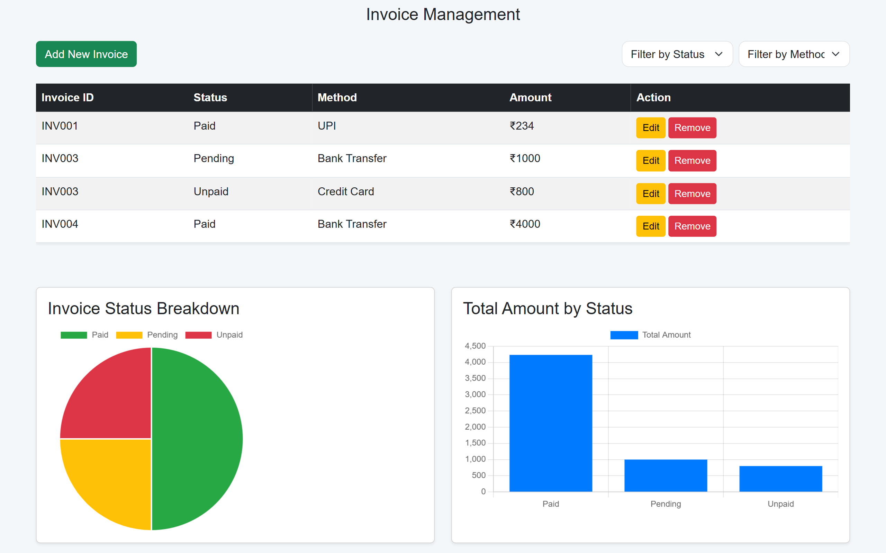

# Invoice Management Web Application

[](https://developer.mozilla.org/en-US/docs/Web/Guide/HTML/HTML5)
[](https://developer.mozilla.org/en-US/docs/Web/CSS)
[](https://developer.mozilla.org/en-US/docs/Web/JavaScript)
[](./LICENSE)

---

## 🚀 Live Demo

👉 [View the Application](https://yourusername.github.io/invoice-management-app/)

---

## 🧾 Overview

The Invoice Management Web Application is a responsive single-page application designed to streamline invoice tracking and management. It offers user authentication, dynamic invoice listing, filtering capabilities, and real-time data visualization through interactive charts.

---

## 🛠️ Built With
- [Bootstrap 5.3](https://getbootstrap.com/)
- [Chart.js](https://www.chartjs.org/)
- Vanilla JavaScript (ES6)
- HTML5 & CSS3

---

## 📸 Screenshots

### Dashboard



---

## ✨ Features

- **User Authentication**
- **Invoice Management**:
- **Filtering Options**:
- **Data Visualization**:
- **Responsive Design**:
- **Local Storage Integration**:

---

## 🚀 Getting Started

To set up and run the application locally:

1. **Clone the repository:**

   ```bash
   https://github.com/madashivakarthikgoud/invoicemanagement.git
   ```

2. **Navigate to the project directory:**

   ```bash
   cd invoicemanagement
   ```

3. **Open the application in your browser:**

   Simply open the `index.html` file in your preferred web browser.

*Note: As this is a frontend application, no additional server setup is required.*

---

## 🎯 Usage

Upon launching the application:

1. **Login**: Use the credentials:

   * **Username**: `admin`
   * **Password**: `password`

2. **Dashboard**: Access the main dashboard to view, add, edit, or delete invoices.

3. **Filtering**: Utilize the dropdown menus to filter invoices by status or payment method.

4. **Visualization**: Observe real-time updates in the charts as you manage invoices.([GitHub][1])

---

## 📂 Project Structure

```
invoicemanagement/
├── index.html
├── LICENSE
└── README.md
```

---

## 📄 License

This project is licensed under the MIT License. See the [LICENSE](./LICENSE) file for details.

---

## 🤝 Contributing

Contributions are welcome! Please fork the repository and submit a pull request for any enhancements or bug fixes.
